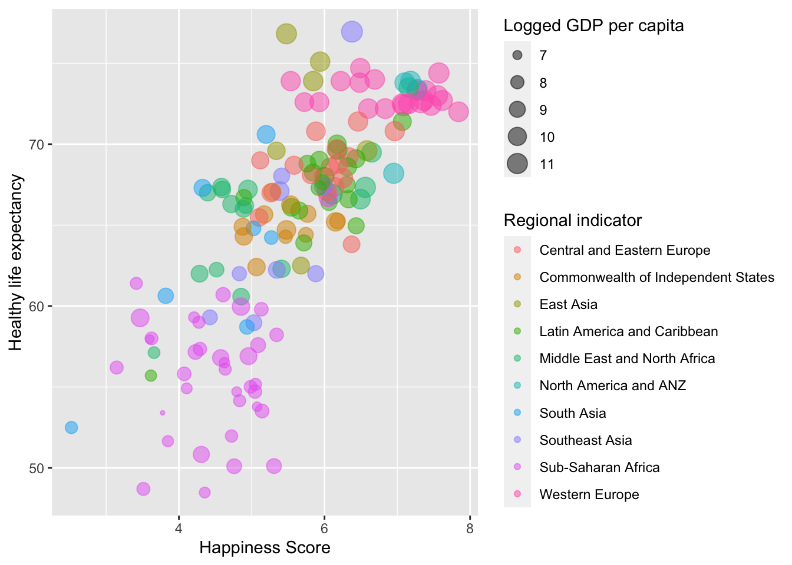
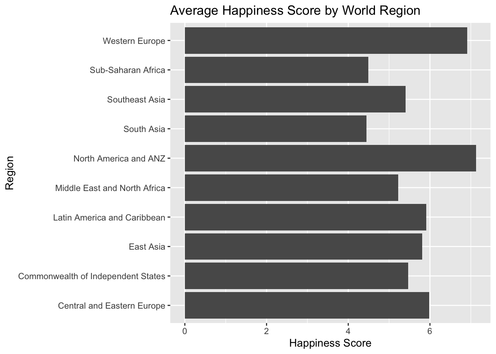
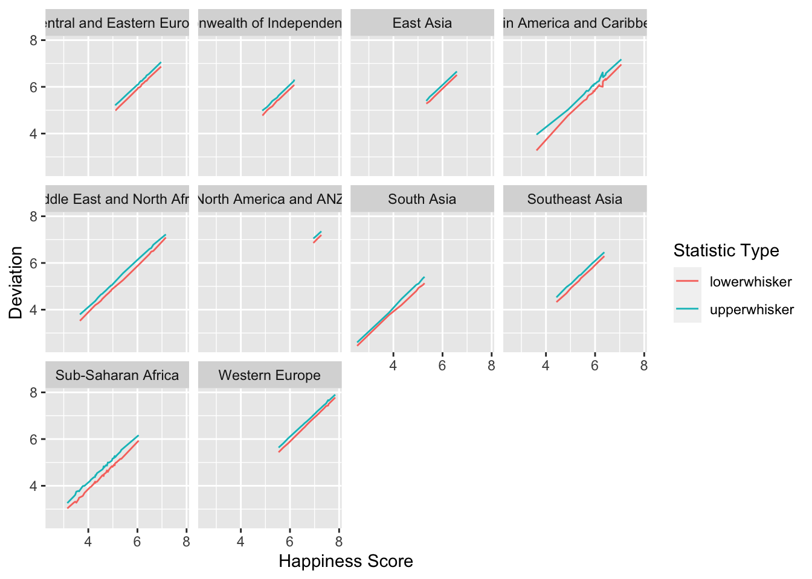
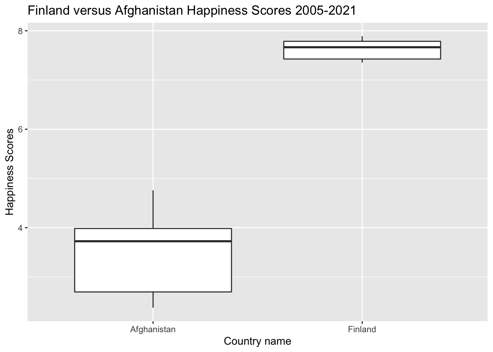
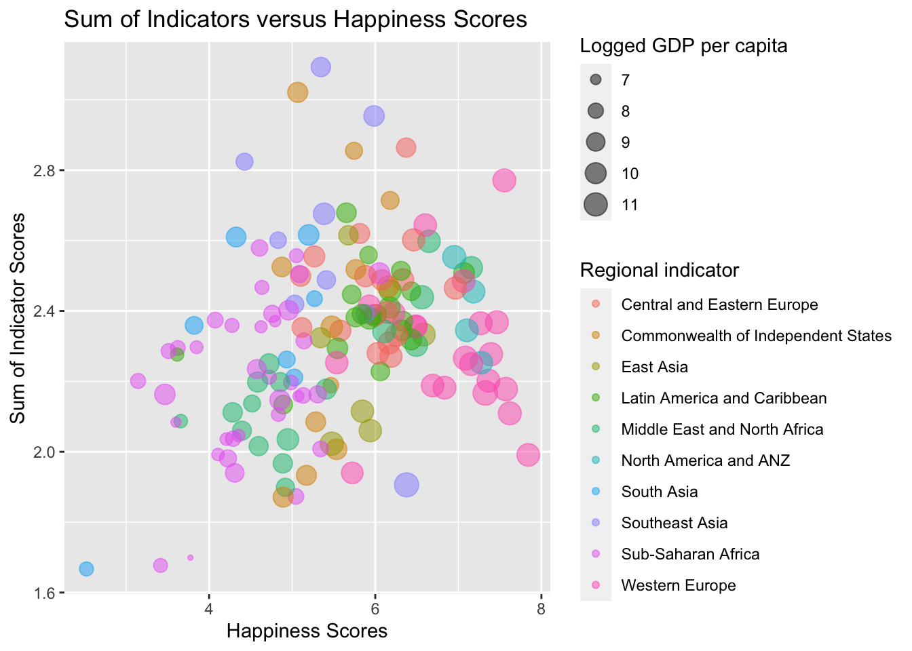

## Introduction
The data sets being explored in this assignment are derived from the World Happiness Report. The data is collected from a survey that determines the state of global happiness based on an overall score for each country. The report has been used by governments, organizations and civil societies, as they utilize this information to inform their policy making decisions.

This assignment has leveraged two data sets specifically:

* World Happiness Report (2021)
* World Happiness Report (2005 - 2020)

Here is a glimpse of the two data sets to assist in the understanding of the data that is captured within these reports. Please note that "Ladder Score" and "Life Ladder" refer to the overall happiness scores of the countries

### World Happiness Report 2021

```
## Rows: 149
## Columns: 20
## $ `Country name`                               <chr> "Finland", "Denmark", "Sw…
## $ `Regional indicator`                         <chr> "Western Europe", "Wester…
## $ `Ladder score`                               <dbl> 7.842, 7.620, 7.571, 7.55…
## $ `Standard error of ladder score`             <dbl> 0.032, 0.035, 0.036, 0.05…
## $ upperwhisker                                 <dbl> 7.904, 7.687, 7.643, 7.67…
## $ lowerwhisker                                 <dbl> 7.780, 7.552, 7.500, 7.43…
## $ `Logged GDP per capita`                      <dbl> 10.775, 10.933, 11.117, 1…
## $ `Social support`                             <dbl> 0.954, 0.954, 0.942, 0.98…
## $ `Healthy life expectancy`                    <dbl> 72.000, 72.700, 74.400, 7…
## $ `Freedom to make life choices`               <dbl> 0.949, 0.946, 0.919, 0.95…
## $ Generosity                                   <dbl> -0.098, 0.030, 0.025, 0.1…
## $ `Perceptions of corruption`                  <dbl> 0.186, 0.179, 0.292, 0.67…
## $ `Ladder score in Dystopia`                   <dbl> 2.43, 2.43, 2.43, 2.43, 2…
## $ `Explained by: Log GDP per capita`           <dbl> 1.446, 1.502, 1.566, 1.48…
## $ `Explained by: Social support`               <dbl> 1.106, 1.108, 1.079, 1.17…
## $ `Explained by: Healthy life expectancy`      <dbl> 0.741, 0.763, 0.816, 0.77…
## $ `Explained by: Freedom to make life choices` <dbl> 0.691, 0.686, 0.653, 0.69…
## $ `Explained by: Generosity`                   <dbl> 0.124, 0.208, 0.204, 0.29…
## $ `Explained by: Perceptions of corruption`    <dbl> 0.481, 0.485, 0.413, 0.17…
## $ `Dystopia + residual`                        <dbl> 3.253, 2.868, 2.839, 2.96…
```

### World Happiness Report (2005 - 2020)

```
## Rows: 1,949
## Columns: 11
## $ `Country name`                     <chr> "Afghanistan", "Afghanistan", "Afgh…
## $ year                               <dbl> 2008, 2009, 2010, 2011, 2012, 2013,…
## $ `Life Ladder`                      <dbl> 3.724, 4.402, 4.758, 3.832, 3.783, …
## $ `Log GDP per capita`               <dbl> 7.370, 7.540, 7.647, 7.620, 7.705, …
## $ `Social support`                   <dbl> 0.451, 0.552, 0.539, 0.521, 0.521, …
## $ `Healthy life expectancy at birth` <dbl> 50.80, 51.20, 51.60, 51.92, 52.24, …
## $ `Freedom to make life choices`     <dbl> 0.718, 0.679, 0.600, 0.496, 0.531, …
## $ Generosity                         <dbl> 0.168, 0.190, 0.121, 0.162, 0.236, …
## $ `Perceptions of corruption`        <dbl> 0.882, 0.850, 0.707, 0.731, 0.776, …
## $ `Positive affect`                  <dbl> 0.518, 0.584, 0.618, 0.611, 0.710, …
## $ `Negative affect`                  <dbl> 0.258, 0.237, 0.275, 0.267, 0.268, …
```

## Methodology
This assignment allowed for the exploration into different types of functions that can be leveraged to visualize a data set. A summary of the functions used within this assignment are as follows:

One Table Verb

* arrange()
* filter()
* rename()
* summarize()

Two Table Verb

* bind_rows()
* %>%
* glimpse

Grouping

* group_by()
* rowwise()

Vector

* desc()
* first()

Pivoting

* pivot_longer()
* pivot_wider()

Missing values

* drop_na()
* replace_na()

The use of each function will be further described as they are presented below and utilize to create visuals for this data set, but this overview is intended to provide a brief summary of the functions used as required by the assignment.

## Data Analysis and Visualization

### Happiness Score vs Life Expectancy in 2021
The first figure presented is intended merely to provide insight into the data set and to begin to understand correlations within the data. This figure does not contain any required functions for the assignment, but was created to provide initial commentary and a departure point for further analysis. 

The following graph describes the correlation between Happiness Score and Healthy Life Expectancy. The points have been colored to represent the region of the world the country can be found in, and they have been sized to represent the logged GDP per capita.

We can see a clear correlation here between Happiness and Healthy Life Expectancy, and it has also been noted that countries within the same region tend to have similar happiness scores to one another. Additionally, the higher the logged GDP per capita, the higher the happiness score tends to be.



### Average Happiness Score by Region in 2021
While it's expected that countries within the same regions will have similar happiness scores, this analysis was taken a step further by grouping the data of the countries by region, and determining the mean happiness score. 

The functions used here include:

* group_by()
* summarize

The plot shows that the "Happiest" region in the world is North America and ANZ, while the least "Happiest" region is South Asia.


### Happiness Score Variability by Region 2021
While the above plot shows us the mean happiness score for each of the regions, we know there is a certian level of variability within each of the scores. The data set contains a Happiness Score, and also contains information on the "upper whisker" and "lower whisker" of the data, which allows us to understand the level of variability within each happiness score.

The following function was used:

* pivot_longer()

To put the upper and lower whisker values into a single column, and use another column to identify whether the value is upper or lower whisker, rather than having these values in separate columns. 

This was then plotted by region so we can see what kind of variability there is within the region, but also the upper and lower limits of these determined scores.


### Least Happy Region Ranking in 2021
The lowest scoring region has been identified as South Asia. With the following table, we look into the countries that make up the South Asia region, and order the data in descending order to gain additional insight. The functions used here include:

* filter()
* arrange()
* desc()


```
## # A tibble: 7 x 20
##   `Country name` `Regional indica… `Ladder score` `Standard error … upperwhisker
##   <chr>          <chr>                      <dbl>             <dbl>        <dbl>
## 1 Maldives       South Asia                  5.20             0.072         5.34
## 2 Sri Lanka      South Asia                  4.32             0.066         4.45
## 3 Nepal          South Asia                  5.27             0.07          5.41
## 4 Bangladesh     South Asia                  5.03             0.046         5.12
## 5 Pakistan       South Asia                  4.93             0.068         5.07
## 6 India          South Asia                  3.82             0.026         3.87
## 7 Afghanistan    South Asia                  2.52             0.038         2.60
## # … with 15 more variables: lowerwhisker <dbl>, Logged GDP per capita <dbl>,
## #   Social support <dbl>, Healthy life expectancy <dbl>,
## #   Freedom to make life choices <dbl>, Generosity <dbl>,
## #   Perceptions of corruption <dbl>, Ladder score in Dystopia <dbl>,
## #   Explained by: Log GDP per capita <dbl>, Explained by: Social support <dbl>,
## #   Explained by: Healthy life expectancy <dbl>,
## #   Explained by: Freedom to make life choices <dbl>,
## #   Explained by: Generosity <dbl>,
## #   Explained by: Perceptions of corruption <dbl>, Dystopia + residual <dbl>
```

### Happiest and Least Happiest Countries in 2021
Taking the analysis of happiest and least happiest regions a step further, the top 5 and bottom 5 countries were extracted based on their overall happiness score. The data was already arranged from highest to lowest happiness score, to the following functions were used to extract the relevant data:

* first() - to extract the first column of country names
* head() - to extract the first 5 values
* tail() - to extract the bottom 5 values


```
## [1] "Finland"     "Denmark"     "Switzerland" "Iceland"     "Netherlands"
```

```
## [1] "Lesotho"     "Botswana"    "Rwanda"      "Zimbabwe"    "Afghanistan"
```

Here we see that the happiest country is Finland, and the least happiest country is Afghanistan.

### Finland vs Afghanistan (2005-2021)
Here we merge the historic Happiness Report with the 2021 Happiness report. The following functions are used:

* rename()
* bind_rows()
* filter()

Since the Happiness Score is referred to as the "Ladder Score" in 2021, but has been previously referred to as "Life Ladder" in the historic data report, the 2021 report column was renamed to reflect the historic data label. This then allowed the hapiness scores to merge and create a comprehensive set of information to reflect up to date date.

The following figures look at the data from 2005 to 2021 for the highest and lowest scoring countries, Finland and Afghanistan, using a boxplot. This allows us to observe what kind of variability has been experienced in the happiness scores over the last several years for each country.


We can see that there is a significant gap between the happiness scores of these two countries. We can also observe a higher level of variability of the past several years in the scores obtained from Afghanistan, and very little variability in the scores from Finland.

### Correlation Between Indicators and Happiness Score in 2021
There are four key indicators that are measured in the survey. They are:

* Social support
* Freedom to make life choices
* Generosity
* Perceptions of corruption

Out of curiosity, the sum of the scores within these four indicators for each country were tabulated and plotted against the Happiness Scores to observe whether there was any clear correlation between the total sum and the overall score.

The functions used here include:

* rowwise()
* mutate()
* sum()


We can see here that there is no real correlation when simply adding the scores together. This implies that weighted factors are used to determine the happiness score, and other measured areas such as GDP, are also high contributing factors to the calculation of the happiness score.

### Data Formatting
There are a few data frame manipulation functions that are helpful when it comes to structuring data in a way that makes sense for the analysis. The function pivot_longer() was utilized earlier to re-structure how the upper and lower limits of the happiness score were presented in the data set.

A second attempt at re-structuring the data is shown below, using:

* pivot_wider()
* replace_na()

This allowed for the ladder scores to be presented underneath a column labeled by the regional indicator for that country. It's not recommended that the data be formatted this way, but the capabilities of pivoting the data are nonetheless very valuable.

Since this data structure resulted in a significant portion of "NA" fields, this was replaced with the comment "Not in Region" to make it easier to review.


```
## # A tibble: 149 x 28
##    `Country name` `Standard error of… upperwhisker lowerwhisker `Logged GDP per…
##    <chr>          <chr>               <chr>        <chr>        <chr>           
##  1 Finland        0.032               7.904        7.78         10.775          
##  2 Denmark        0.035               7.687        7.552        10.933          
##  3 Switzerland    0.036               7.643        7.5          11.117          
##  4 Iceland        0.059               7.67         7.438        10.878          
##  5 Netherlands    0.027               7.518        7.41         10.932          
##  6 Norway         0.035               7.462        7.323        11.053          
##  7 Sweden         0.036               7.433        7.293        10.867          
##  8 Luxembourg     0.037               7.396        7.252        11.647          
##  9 New Zealand    0.04                7.355        7.198        10.643          
## 10 Austria        0.036               7.337        7.198        10.906          
## # … with 139 more rows, and 23 more variables: Social support <chr>,
## #   Healthy life expectancy <chr>, Freedom to make life choices <chr>,
## #   Generosity <chr>, Perceptions of corruption <chr>,
## #   Ladder score in Dystopia <chr>, Explained by: Log GDP per capita <chr>,
## #   Explained by: Social support <chr>,
## #   Explained by: Healthy life expectancy <chr>,
## #   Explained by: Freedom to make life choices <chr>,
## #   Explained by: Generosity <chr>,
## #   Explained by: Perceptions of corruption <chr>, Dystopia + residual <chr>,
## #   Western Europe <chr>, North America and ANZ <chr>,
## #   Middle East and North Africa <chr>, Latin America and Caribbean <chr>,
## #   Central and Eastern Europe <chr>, East Asia <chr>, Southeast Asia <chr>,
## #   Commonwealth of Independent States <chr>, Sub-Saharan Africa <chr>,
## #   South Asia <chr>
```
It was noted that there were countries that contained no scores in some of the evaluation areas. These were remvoed using the function:

* drop_na()


```
## # A tibble: 1,708 x 11
##    `Country name`  year `Life Ladder` `Log GDP per capita` `Social support`
##    <chr>          <dbl>         <dbl>                <dbl>            <dbl>
##  1 Afghanistan     2008          3.72                 7.37            0.451
##  2 Afghanistan     2009          4.40                 7.54            0.552
##  3 Afghanistan     2010          4.76                 7.65            0.539
##  4 Afghanistan     2011          3.83                 7.62            0.521
##  5 Afghanistan     2012          3.78                 7.70            0.521
##  6 Afghanistan     2013          3.57                 7.72            0.484
##  7 Afghanistan     2014          3.13                 7.72            0.526
##  8 Afghanistan     2015          3.98                 7.70            0.529
##  9 Afghanistan     2016          4.22                 7.70            0.559
## 10 Afghanistan     2017          2.66                 7.70            0.491
## # … with 1,698 more rows, and 6 more variables:
## #   Healthy life expectancy at birth <dbl>, Freedom to make life choices <dbl>,
## #   Generosity <dbl>, Perceptions of corruption <dbl>, Positive affect <dbl>,
## #   Negative affect <dbl>
```

## Discussion
This dataset was very interesting and insightful. The initial investigative analysis showcases that there are clear correlations between various indicators and the overall happiness score of a given country. It is also clear that there are entire regions in the world that are not performing well when it comes to the happiness of their citizens. 

This data is extremely useful when evaluating initiatives that should be undertaken to improve the quality of life within a country. It's clear that the higher the happiness score, the longer the healthy life expectancy, so it's important that governments and organizations are committed to providing a positive environment and quality of life for their citizens if they want them to lead long and happy lives.

Throughout the data analysis of this assignment, the first issue encountered was the loss of my Terminal tab. This was rectified with advice from Dr. Verma. The second issue during this assignment was finding functions that could be used with the data set I chose. I found it difficult to incorporate the pivoting functions, just due to the nature and lay out of the data set that I had. Overall, this assignment was a great opportunity to practice utilizing the functions available in tidyverse and dplyr. 

